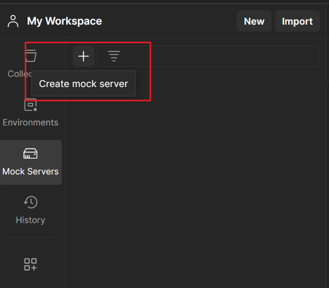
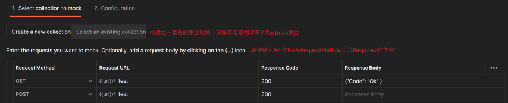
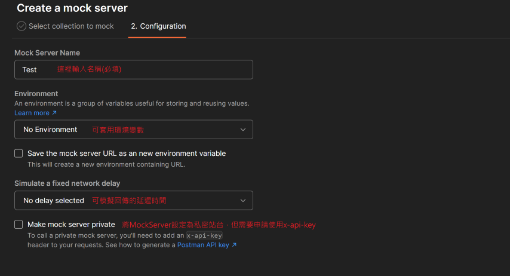
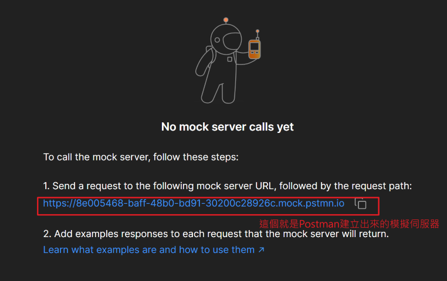
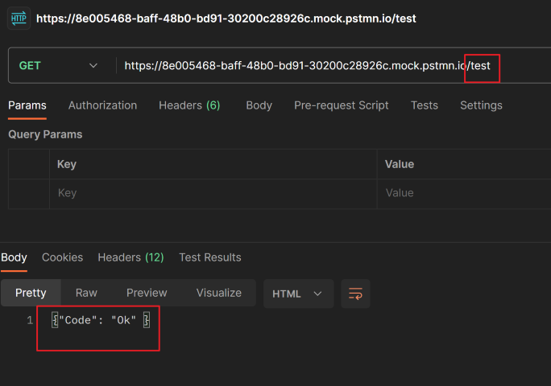

# MockServer是什麼?

MockServer 是Postman提供的一項功能
他可提供使用者建立一個模擬的API站台
可以自訂這個模擬站台的API的Request&Response的內容

# 怎麼使用?
## 首先到Postman找到MockServer標籤，上面有個+鈕，建立mock server

## 可以決定要從原有的集合建立mockserver，或是現在寫一份自訂的Reqeust&Response

## 下一步，填上MockServer名稱

## 下一步，Postman就建立完成MockServer了，連結可以直接使用

## 馬上來測試剛剛建立的API，可以發現回傳如我們所設定的內容是一樣的

# 日常實務

## Backend&F2E共同開發

專案或是Sprint開發初期，
常常會有F2E因為要等待Backend API開發完成的情形。

通常解決方法，
是先請Backend寫一個回傳固定參數的API，給F2E先做串接。

如果使用MockServer，後端可簡單用Postman訂好規格後交給F2E，
F2E可使用MockServer在開發期間進行串接，就減少來回等待的時間。

1. 專案開始
2. 後端RD用Postman訂好API規格
3. 將規格匯出給F2E
4. 2E基於此規格建立MockServer開發
5. 後端基於此規格開始開發API

## 模擬測試特殊情境

專案一定會遇到一種狀況，
今天程式呼叫第三方的API，在某個很不巧的情況之下...
對方的API回覆了一個特殊的錯誤，導致程式出現了不可預期的狀況，
比如異常的特殊錯誤代碼或是逾時回應等等。

接著會接收到任務說，"啊，這題你要修一下，避免下次再發生"
但你不知道怎麼重新復原這個狀況去Deubg，總不可能請對方API回覆那個錯誤狀況吧?

這時候就可以使用MockServer，模擬對方API一直回覆指定的錯誤，
接下來就能夠接手開發啦。
